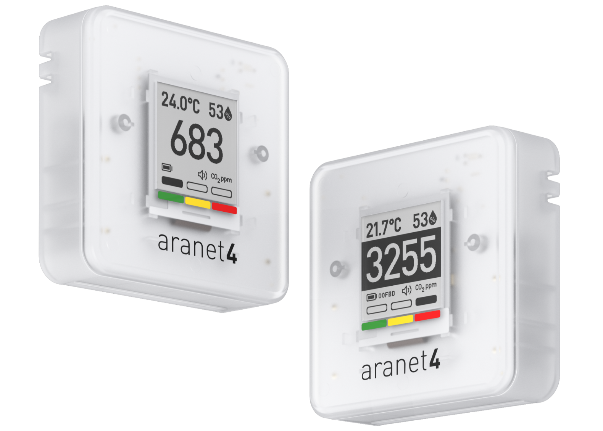
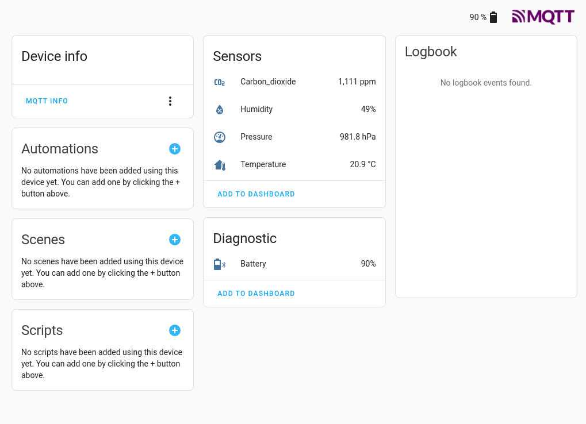

# Aranet4-MQTT

The [Aranet4](https://aranet.com/products/aranet4/) is a great (but expensive!) CO2 monitor. 

It has bluetooth and can be paired with a mobile phone to get temperature, humidity, pressure and carbon dioxide readings (while within range).

The [Aranet4-Python project](https://github.com/Anrijs/Aranet4-Python) uses bluetooth to programmatically (via Python) access the sensor readings and return them to the host machine. 
This script uses the Aranet4-Python program (unchanged) and wraps it in a bash script. The script calls the python program, parses the response and creates an [MQTT](https://mosquitto.org/) message with the results.

In addition to the regular sensor payload, this script also facilitates integration with [Home Assistant](https://www.home-assistant.io/) by sending [MQTT discovery](https://www.home-assistant.io/integrations/mqtt/#mqtt-discovery) messages upon startup and announcing the device's availability via MQTT.

## Usage
Edit query_aranet4.properties. Provide connection details to your MQTT broker. 
ARANETCTL_DIR is the directory where the aranetctl program from Aranet4-Python project is located.

query_aranet4.sh \<bluetooth MAC\> \<sensor name\>
   
`$ query_aranet4.sh EF:BE:2D:BA:DD:A5 aranet4-dda5`
   
Alternatively, to run automatically use the included systemd services file aranet4-dda5.service.

## Operations
1. Announce the various sensors available on Aranet4 (temp, humidity, etc) to Home Assistant via MQTT discovery.
2. Send an availability "online" message to announce to Home Assistant the sensor is working. In the event of the sensor or script not functioning, the MQTT last will message will automatically set availability to "offline".
3. Make Aranet inquiries (via Aranet4-Python project) and parse the response into an MQTT sensor state payload which will be published. It will do this forever, spacing each inquiry by REFRESH_RATE
   
## Prerequisites
1. Aranet4 sensor must be bluetooth paired to this host
2. [Aranet4-Python project](https://github.com/Anrijs/Aranet4-Python) installed into [virtualenv Python 3.10](https://docs.python.org/3.10/library/venv.html)
3. MQTT Mosquitto broker running at specified location
4. Mosquitto client programs available on path; `apt install mosquitto-clients`
5. Create directory /var/run/aranet4-daemon/ (see $PID_DIR in query_aranet4.properties) writable by the user that will be used to run this script
6. (optional) If you plan on launching this script as a systemd daemon, edit the example aranet4*.service file with the correct User, WorkingDirectory and ExecStart for your setup
